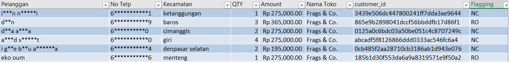

# **Sales Fabs.co Analysis**

## Project Overview

Proyek ini merupakan bagian dari **technical test** yang bertujuan untuk melakukan analisis data pelanggan berdasarkan **identifikasi unique customer ID**, **flagging pelanggan baru atau repeat order**, serta **analisis RFM (Recency, Frequency, Monetary)** untuk memperkaya wawasan bisnis.

Pendekatan yang digunakan mencakup:

1. **Manual Approach** untuk identifikasi unique customer ID.
2. **Similarity Distance & Agglomerative Clustering Approach** untuk mengelompokkan customer ID yang berpotensi duplikat berdasarkan kesamaan atribut.
3. Penentuan **flagging**:

   * **NC (New Customer)** → Pelanggan yang baru pertama kali melakukan transaksi.
   * **RO (Repeat Order)** → Pelanggan yang sudah pernah bertransaksi sebelumnya.
4. **RFM Analysis** untuk memberikan insight terhadap perilaku pelanggan berdasarkan:

   * **Recency** → Seberapa lama sejak transaksi terakhir.
   * **Frequency** → Seberapa sering pelanggan bertransaksi.
   * **Monetary** → Total nilai pembelian pelanggan.

---

## Methodology

### 1️⃣ Identifikasi Unique Customer ID

#### a. Manual Approach

* Menggunakan kombinasi kolom kunci seperti nama pelanggan, nomor telepon, dan alamat untuk mendeteksi duplikasi secara langsung.
* Pendekatan ini bersifat **deterministik** dan cocok untuk data yang konsisten dan lengkap.

#### b. Similarity Distance & Agglomerative Clustering Approach

* Menghitung jarak kesamaan (string similarity) antar kolom nama pelanggan, nomor telepon, dan alamat menggunakan metrik seperti **Levenshtein distance**.
* Mengelompokkan data menggunakan **Agglomerative Clustering** untuk mengidentifikasi kemungkinan duplikat walaupun terdapat variasi penulisan.
* Lebih fleksibel dalam mendeteksi duplikasi data yang tidak persis sama.

---

### 2️⃣ Penentuan Flagging Pelanggan

* Penentuan dilakukan dengan memeriksa riwayat transaksi berdasarkan `customer_id` yang telah didapatkan dengan mengambil nilai nunique dari nomor invoice di mana jika jumlah invoice unik dari pelanggan adalah lebih dari 1 maka pelanggan tersebut diidentifikasi flagging **RO**, sebaliknya jika nilai jumlah invoice unik pelanggan adalah 1 maka pelanggana diidentifikasi flagging **NC** .

---

### 3️⃣ RFM Analysis

* **Recency** dihitung sebagai selisih hari antara tanggal transaksi terakhir dan tanggal referensi analisis.
* **Frequency** dihitung berdasarkan jumlah transaksi unik per pelanggan.
* **Monetary** dihitung dari total nilai transaksi pelanggan.
* Dilakukan segmentasi untuk menemukan kelompok pelanggan potensial dan strategis bagi bisnis.

---

## Sample Results

### Contoh Flagging Pelanggan



### Contoh Segmentasi RFM

.jpg)

---

## Requirements

Untuk menjalankan proyek ini, pastikan environment Python sudah memiliki library berikut:

```bash
pipenv install -r requirements.txt
```

**Main Dependencies:**

* pandas
* numpy
* scikit-learn
* fuzzywuzzy
* matplotlib / seaborn

---

## How to Run

1. **Clone repository**:

```bash
git clone <repo-url>
cd <repo-folder>
```

2. **Create virtualenv**

3. **Install dependencies**:

```bash
pipenv install -r requirements.txt
```

4. **Jalankan analisis** melalui notebook sesuai kebutuhan:

---

## Business Impact

Dengan pendekatan ini, perusahaan dapat:

* Mengurangi duplikasi data pelanggan yang mengganggu akurasi analisis.
* Mengidentifikasi pelanggan baru dan pelanggan setia secara otomatis.
* Menggunakan analisis RFM untuk strategi pemasaran yang lebih tepat sasaran.

---